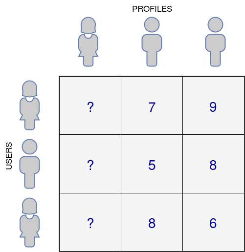

# simple-pyspark-recommedation-engine
PySpark ALS (Alternating-Least-Squares) approach to Recommendation System implementation using Collaborative Filtering techniques.
See full tutorial (spanish) at https://medium.com/datos-y-ciencia/intro-als-pyspark-7de7f3ba3b0a

